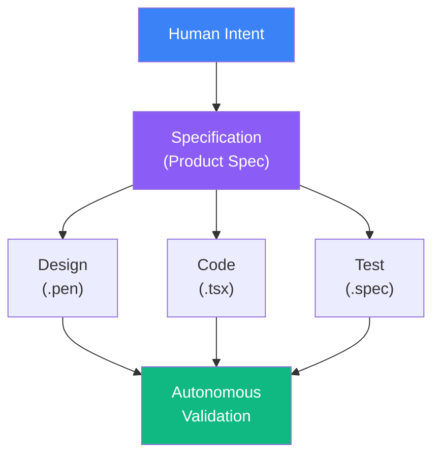
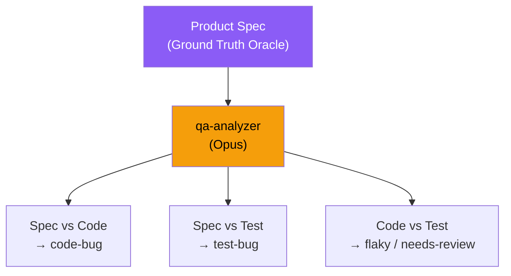
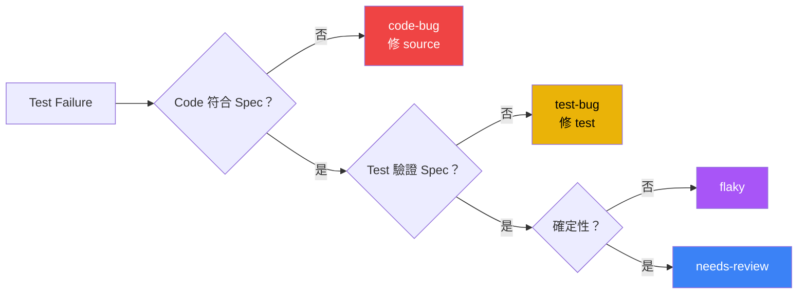

# Harness Engineering

## 你怎麼知道 AI 寫的 Code 是對的？

<div class="abs-br m-6 text-sm opacity-50">
BerryBoard Tech Sharing — 2026-04-18
</div>

<!--
大家好，我是 Wayne。今天要分享的主題是 Harness Engineering。

先問大家一個問題——如果今天你的 AI 助手幫你寫了一段 code，你怎麼知道它是對的？

這不是哲學問題。這是我過去 49 天每天在回答的工程問題。
-->

---
layout: center
class: text-center
---

# 一個反直覺的數據

<div class="mt-16 text-2xl opacity-80">
過去 49 天，62% 的 code 不是我寫的 — 但它通過了 QA 驗證
</div>

<div class="mt-4 text-xl opacity-50 italic">
這怎麼可能是對的？
</div>

---
layout: quote
---

# 「有沒有一種可能，起一個 QA agent 每天工作 8 小時，都在測試這個專案，有問題就發 issue 到 Linear？」

<div class="mt-4 text-right opacity-60">
— Wayne, 2026-03-24, Day 7
</div>

<!--
這是 30 天前我在 Claude Code 裡打的一句話。

不是精心設計的架構。不是讀了十篇論文後的結論。就是一個隨口的想法。

但這句話變成了今天你要看到的 9-Agent QA Pipeline 的起點。

接下來讓我們看看，從這句話開始，49 天後變成了什麼。
-->

---

# 49 天，1 個人

<div class="grid grid-cols-2 gap-8 mt-4">
<div>

| 指標 | 數值 |
|------|------|
| 專案啟動日 | 2026-02-28 |
| 全職工程師 | **1 人** |
| 總 commit 數 | 461 |
| AI co-authored | 284 (62%) |
| 總 PR 數 | 72（merged 57） |
| QA Bot 自動 PR | 30（merged 18） |

</div>
<div>

| 指標 | 數值 |
|------|------|
| 產品程式碼 | 13,545 行 |
| E2E 測試碼 | 2,592 行 / 16 檔 |
| 產品規格文件 | 53 份 |
| 執行計劃文件 | 25 份 |
| Feature modules | 5 個 |
| Route coverage | 13/13 (100%) |

</div>
</div>

<div class="mt-6 text-center text-2xl font-bold">
62% AI co-authored · 98.95% E2E pass · 13/13 route coverage
</div>

<div class="mt-2 text-center opacity-60">
為 1,000+ 門市設計的內部數據平台 — 目前 QA 驗證階段
</div>

<!--
這些不是虛構的數字。BerryBoard 是一個為 1000+ 門市設計的營運數據平台，目前在 QA 驗證階段。

重點不是數字大，而是——62% 的 commit 是 AI 寫的。那品質怎麼保證？
-->

---

# 問題來了

<div class="mt-16 text-3xl text-center leading-relaxed">

你怎麼知道 AI 寫的 code **是對的**？

你怎麼知道 AI **沒有漏掉什麼**？

</div>

<div class="mt-12 text-center text-xl opacity-70">
兩個核心命題 —— <span class="text-green-400 font-bold">可行性 (Feasibility)</span> 與 <span class="text-amber-400 font-bold">完備性 (Completeness)</span>
</div>

<!--
這就是今天要回答的兩個核心問題。

可行性比較容易——你看結果就知道。

但完備性非常難——你怎麼證明「沒有遺漏」？這是一個 open problem。
-->

---
layout: section
---

# 第一部分
## 重新定義「AI Coding」

---

# 你以為的 AI Coding

<div class="mt-8">

```
人寫 code → AI 自動補完 → 人看一眼 → 接受
```

</div>

<div class="mt-6 text-xl">

這是 **Autocomplete Paradigm** — GitHub Copilot 級別

加速了「打字」，但 engineering 的核心挑戰不在打字

</div>

---

# 真正的 AI Coding

<div class="mt-4">



</div>

<div class="mt-4 text-lg text-center">

**Full-lifecycle autonomous software engineering**

人的角色：<span class="text-blue-400 font-bold">寫 spec + 做決策</span> &nbsp;|&nbsp; AI 的角色：<span class="text-green-400 font-bold">設計 → 實作 → 測試 → 修復 → 報告</span>

</div>

---
layout: section
---

# 第二部分
## AI-Native Development Pipeline

---

# 五層管線：從意圖到交付

<div class="mt-6">

| Layer | 名稱 | 執行者 | 工具 |
|-------|------|--------|------|
| **0** | Intent Formalization | 人 | 自然語言 |
| **1** | Design Materialization | AI | Pencil MCP |
| **2** | Specification Decomposition | AI | Superpowers SDD |
| **3** | Implementation Synthesis | AI | Claude Code + Agents |
| **4** | Autonomous Verification | AI | **9-Agent QA Pipeline** |

</div>

<div class="mt-6 text-center text-lg">

每一層都是 AI-native — 不是「AI 輔助人」，而是「人設定意圖，AI 執行完整工程流程」

</div>

---

# Layer 0 → 2：Intent → Design → Spec

<div class="grid grid-cols-2 gap-6 mt-4">
<div>

### Pencil.dev (Layer 1)
- AI-native 設計工具
- 透過 MCP 讓 Claude 直接讀寫設計檔
- 設計是 **machine-readable artifact**

### Superpowers SDD (Layer 2)
- Route Spec：頁面行為規格
- Design Spec：元件結構、互動模式
- Execution Plan：分步驟實作計劃

</div>
<div>

```markdown
# 範例：forgot-password.md

## AC-FP-001: Email Input Validation
- Given: invalid email format
- When: clicks "Send Code"
- Then: show "Please enter a valid email"
- And: button disabled during API call

## AC-FP-008: Expired Reset Code
- Given: code expired (30 min)
- When: submits expired code
- Then: "Code expired, request a new one"
```

</div>
</div>

<div class="mt-4 text-center text-amber-400 font-bold">
Spec 是後續所有驗證的 ground truth oracle
</div>

---

# Layer 3：Spec → Implementation

<div class="grid grid-cols-2 gap-6 mt-4">
<div>

### Claude Code Session
1. Read spec (route + design)
2. Read existing code
3. Generate implementation
4. Run typecheck + lint
5. Run tdd-guide agent
6. Run security-reviewer agent
7. Run pr-review skill (4-dimension gate)
8. Create PR

</div>
<div>

### 15 Specialized Agents

```markdown
---
model: sonnet
timeout: 1200
tools: ["Bash", "Read", "Write"]
---

# qa-planner

You are the QA planner agent.
Your job is to decompose product
specifications into a structured,
machine-readable test plan...
```

**Prompt-as-Code** — 100% 透明、可審計、可版本控制

</div>
</div>

---
layout: section
---

# 第三部分
## 9-Agent QA Pipeline
### 完備性論證的核心

---

# Pipeline 全景

<div class="grid grid-cols-[1fr_1fr] gap-4 mt-2">
<div class="text-sm">

### Linear Pipeline
```
qa-planner (Sonnet)
    ↓ test-plan.json
qa-collector (Haiku)
    ↓ results + artifacts
qa-analyzer (Opus)      ← accuracy bottleneck
    ↓ .issues.json
qa-issue-filer (Sonnet)
    ↓ Linear sync
```

### Branch & Converge
```
可自動修復？
  ├─ yes → qa-fixer (Sonnet)    ─┐
  └─ no  → qa-explorer (Sonnet) ─┤
                                  ↓
              qa-reviewer (Sonnet)  ← trajectory critic
                      ↓
              qa-reporter (Haiku)   → Slack
```

</div>
<div class="mt-2">

### 9 Agents, 3 Model Tiers

| Tier | Agents | Why |
|------|--------|-----|
| **Opus** | analyzer | 跨領域推理 |
| **Sonnet** | planner, fixer, explorer, reviewer, issue-filer | Code gen + 結構化 |
| **Haiku** | collector, reporter | 純執行 |

<div class="mt-4 p-3 bg-green-900/30 rounded-lg text-center font-bold">
每天 2 次（08:00 + 00:00）<br/>
零人工・~$2-4/run・~45 min
</div>

</div>
</div>

<!--
這是 9 個 agent 的完整 pipeline。每天自動跑兩次。

關鍵設計：不是所有 agent 都用最貴的 model。Opus 只用在 analyzer——因為分類決策是 accuracy bottleneck。

一次跑完大約 45 分鐘，成本 2-4 美金。
-->

---

# The Verification Paradox

<div class="mt-2 p-3 bg-blue-900/20 rounded-lg italic text-lg">
「我目前遇到一個問題——昨天 QA agent 有跑，但現在我無法確認他跑的品質。他開的 issue、他改的 code，有沒有意義？」
<div class="text-right text-sm opacity-60 mt-1">— Day 14, 真實對話紀錄</div>
</div>

<div class="mt-4 text-lg">

```
如果 AI 寫了 code，誰來驗證 code 是對的？
如果 AI 寫了 test，誰來驗證 test 是對的？
如果 AI review 了自己的 output，這算不算 self-grading？
```

</div>

<div class="mt-4 p-4 bg-red-900/30 rounded-lg">

### 傳統做法的隱含假設

```
Spec:  「密碼重置碼 30 分鐘後過期」
Code:  EXPIRY = 60 * 60 * 1000          ← 60 分鐘（BUG）
Test:  assert(expiry === 3600000)        ← 驗證了錯誤行為
CI:    ✅ PASS                            ← False Negative
```

Test 和 Code 都是 AI 寫的 → **Circular Validation 死結**

</div>

<!--
上面那段引言是我真實的對話紀錄。QA agent 跑了一整晚，早上起來看到一堆 issue 和 PR——但我不確定這些東西是不是 AI 在自嗨。

這就是 Verification Paradox 的具體體驗。不是理論，是我第 14 天就撞到的牆。

後面的 Evidence Chain 和 Trajectory Critic 就是為了解決這個問題而設計的。
-->

---

# 解法：Specification-Grounded Tripartite Verification

<div class="grid grid-cols-2 gap-6 mt-4">
<div>



</div>
<div class="mt-4">

### 三角驗證

1. **Spec vs Code** — code 行為符合 spec？→ 否 = `code-bug`
2. **Spec vs Test** — test 驗證的行為符合 spec？→ 否 = `test-bug`
3. **Code vs Test** — 兩者都符合 spec 但 fail → `flaky`

<div class="mt-4 p-3 bg-green-900/30 rounded-lg text-center font-bold">
Spec 是人寫的，Code + Test 是 AI 寫的<br/>
三者出自不同來源 → 消除 self-grading
</div>

</div>
</div>

<!--
我們的解法：用 spec 做 ground truth oracle。

關鍵洞察：spec 是人寫的，code 和 test 是 AI 寫的。三者出自不同來源——所以不是 self-grading。

Analyzer 用 Opus 做跨領域推理：同時讀 spec、code、test，判斷問題出在哪裡。
-->

---

# Evidence Chain Protocol

<div class="grid grid-cols-[1.2fr_0.8fr] gap-4">
<div>

每個 issue 必須附帶 **machine-verifiable proof**：

```json {maxHeight:'240px'}
{
  "type": "code-bug",
  "confidence": "high",
  "evidence": {
    "spec_quote": "Reset codes expire after 30 min",
    "code_quote": "auth.ts:42 — EXPIRY = 3600000",
    "reasoning": "Spec 30min, code 60min"
  }
}
```

</div>
<div>

| 欄位 | 設計原理 |
|------|---------|
| `spec_quote` 逐字引用 | 消除 hallucination |
| `code_quote` 含 file:line | 一鍵跳轉 |
| `reasoning` 最多 2 句 | 強制精確 |

<div class="mt-4 p-3 bg-green-900/30 rounded-lg text-center font-bold">
人類 reviewer 平均<br/>3 秒完成驗證
</div>

</div>
</div>

<!--
每個 issue 不是 AI 的「感覺」——它必須附帶 machine-verifiable proof。

spec_quote 必須逐字引用，不能改寫。code_quote 必須有 file 和行號。reasoning 最多兩句。

效果：人類 reviewer 平均 3 秒就能驗證一個分類是否正確。這是 reviewability by design。
-->

---

# 六類缺陷分類

<div class="grid grid-cols-[1.3fr_0.7fr] gap-4">
<div>



</div>
<div>

| 分類 | 自動化？ |
|-----|---------|
| `code-bug` | Yes — fixer |
| `test-bug` | Yes — fixer |
| `flaky` | Yes — fixer |
| `coverage-gap` | Yes — explorer |
| `perf-regression` | Partial — 人工驗證 |
| `needs-spec-review` | **No — 人工** |

</div>
</div>

---

# Calibrated Confidence

Analyzer 量化自己的 **認知不確定性 (epistemic uncertainty)**：

<div class="grid grid-cols-3 gap-4 mt-4">

<div class="p-3 bg-green-900/30 rounded-lg text-center">
<div class="text-2xl font-bold text-green-400">High</div>
<div class="mt-1">Spec 明確 + Code 明確違反</div>
<div class="mt-1 font-bold">→ 全自動修復</div>
</div>

<div class="p-3 bg-amber-900/30 rounded-lg text-center">
<div class="text-2xl font-bold text-amber-400">Medium</div>
<div class="mt-1">Spec 清楚但 Code 需解讀</div>
<div class="mt-1 font-bold">→ 自動修復</div>
</div>

<div class="p-3 bg-red-900/30 rounded-lg text-center">
<div class="text-2xl font-bold text-red-400">Low</div>
<div class="mt-1">Spec 模糊或缺失</div>
<div class="mt-1 font-bold">→ 強制人工介入</div>
</div>

</div>

<div class="mt-4 text-center text-lg">

**Graduated Autonomy** — Agent 的自主權跟 confidence 成正比

Miscalibration 比 inaccuracy 更危險：accuracy 90% 但 miscalibrated → 自動修了不該修的東西

</div>

<!--
不是所有 issue 都適合自動修復。

High confidence 才全自動。Low confidence 強制 escalate 給人。

重點：miscalibration 比 inaccuracy 更危險。一個說自己很確定但其實不確定的 agent，會自動修掉不該修的東西。
-->

---

# Trajectory Critic：看守 AI 的 AI

**qa-reviewer** 不是一般 code reviewer — 它是 **Trajectory Critic**

<div class="mt-2">

評估整條軌跡，不是單一動作：

```
analyzer 的分類 → fixer 的修復 → PR 的 diff → 測試結果
```

</div>

<div class="mt-3">

| 異常信號 | 含義 | 動作 |
|---------|------|------|
| Low confidence + 嘗試自動修復 | 自動化邊界被突破 | 立即 escalate |
| High confidence + 複雜修復 (>30行) | 認知錯配 | 標記人工審查 |
| 模糊的 `spec_quote` | 證據鏈崩壞 | 阻斷 PR |

</div>

<div class="mt-3 text-center text-lg opacity-80">
Second-Order Quality Assurance — QA 系統的 QA
</div>

---

# Human-in-the-Loop

<div class="p-2 bg-blue-900/20 rounded-lg italic text-base">
「把目前的 QA agent 都停下來，產出太快我目前看不太來。」 <span class="opacity-60">— Day 13</span>
</div>

<div class="mt-2">

```
High Confidence ────→ 全自動（修復 → 審查 → 合併）

Low Confidence  ────→ 人類審查 evidence chain（3 秒驗證 → 判斷 → Fixer 執行）
```

</div>

<div class="mt-6 p-5 bg-blue-900/30 rounded-lg text-center text-xl">

人只看真正困難的 **20%**，80% 的 routine triage **完全自動化**

</div>

<div class="mt-4 text-center text-lg opacity-80">

**Cognitive Load Optimization** — 把人類最稀缺的資源（注意力 + 判斷力）集中在機器最不擅長的領域

</div>

---
layout: section
---

# 第四部分
## 設計哲學

---

# Heterogeneous Model Allocation

Compute budget follows criticality — 算力預算跟著關鍵度走

<div class="mt-6">

| Agent | Model | 認知需求 | 成本 |
|-------|-------|---------|------|
| collector | **Haiku** | 純指令執行 | $ |
| planner | Sonnet | 結構化提取 | $$ |
| fixer | Sonnet | Code gen，最佳性價比 | $$ |
| reporter | **Haiku** | 模板組裝 | $ |
| **analyzer** | **Opus** | 跨領域推理：spec x code x test | $$$ |

</div>

<div class="mt-4 text-center">

Opus 只用在 **accuracy bottleneck** — analyzer 的分類決策

一個 misclassification 是 cascading error → fixer 修錯 → reviewer 批准錯誤 → bug 留在 main branch

**每次執行：~$2-4**

</div>

---

# Share-Nothing Architecture

Agent 之間 **零共享記憶體** — artifact-based message passing

<div class="mt-3">

```
qa-planner  ──writes──▶  test-plan.json  ──reads──▶  qa-collector
qa-collector ──writes──▶  results.json   ──reads──▶  qa-analyzer
qa-analyzer  ──writes──▶  .issues.json   ──reads──▶  qa-issue-filer
```

</div>

<div class="grid grid-cols-2 gap-6 mt-3">
<div class="p-4 bg-blue-900/30 rounded-lg">

### 優點
- 每個 agent 可獨立重跑、debug、替換模型
- 單一 agent 失敗 = 局部事件
- **Blast Radius Containment by Design**

</div>
<div class="p-4 bg-green-900/30 rounded-lg">

### Safety Invariants
- 每次最多修 **3 個 issue**
- 每個 issue 最多 retry **3 次**
- 每次最多改 **50 行**
- 必須跑 targeted + full regression
- 違反任一條 → **立即中止**

</div>
</div>

---

# Infrastructure Minimalism

<div class="mt-6">

| 維度 | Managed Orchestrator | 我們的 Shell Runner |
|------|---------------------|-------------------|
| 外部依賴 | Scheduler + Worker + DB | **零** |
| 可偵錯性 | Web UI + logs | `tail -f` |
| 營運成本 | 基礎設施維護 | **$0** |
| 適用規模 | 100+ tasks | ≤10 agents |

</div>

<div class="mt-8 text-center text-xl">

Orchestration = **500 行 shell script** + launchd plist

不是 Airflow，不是 Temporal

**YAGNI applied to infrastructure**

</div>

---
layout: section
---

# 第五部分
## QA Pipeline 真實數據

---

# Pipeline 真實指標

<div class="grid grid-cols-2 gap-8 mt-4">
<div>

| 指標 | 數值 |
|------|------|
| Pipeline 執行次數 | 14 (7 天) |
| E2E pass rate 趨勢 | 85% → 98.95% |
| Unit test | 344/344 (100%) |
| Route coverage | 13/13 (100%) |
| Issues 自動分類 | 60 個 |
| Issues 自動修復 | 30+ 個 |
| Issues 自動結案 | 46 個 |
| QA Bot PRs | 30 (merged 18) |

</div>
<div>

| 指標 | 數值 |
|------|------|
| 平均 pipeline 時長 | ~45 min |
| 每次 API 成本 | ~$2-4 |
| 需人工介入 | ~20% |
| Learned patterns | 9 個 |
| Page load | Sub-100ms |
| Zero code-bugs | 最近 7 天 |

</div>
</div>

<div class="mt-4 text-center text-lg text-green-400 font-bold">
Source code 完全符合 spec — 所有近期 failure 都是 test-bug / flaky
</div>

---

# QA Bot 實際 PR

<div class="mt-2 text-sm">

| PR | 內容 | 狀態 |
|----|------|------|
| #73 | AC-LOGIN-05 漸進式登入延遲 E2E 覆蓋 | Open |
| #72 | video-link mock URL mismatch 修復 | Open |
| #71 | corp selection 測試補充 | Merged |
| #68 | AC-FP-11 + AC-DASH-02 E2E 覆蓋 | Merged |
| #67 | FastAPI 422 array detail 修復 + 429 test fix | Merged |
| #66 | GA4 error tracking SB-03/04/05 | Merged |
| #64 | Superset iframe error state 修復 | Merged |
| #63 | 429 message 修正 + 422 array detail 處理 | Merged |

</div>

<div class="mt-4 text-center text-lg">

QA Bot 不只寫測試 — 它也修 **source code**

#67 修了 FastAPI 422 處理，#64 修了 iframe error state

**Autonomous Remediation**

</div>

---

# 一個 Issue 的完整旅程

PR #67 實際時間軸 — FastAPI 422 array detail 處理

<div class="mt-3 text-sm">

```
03:47  qa-collector   E2E 失敗：login 測試 "Cannot read property of array"
04:02  qa-analyzer    分類 code-bug · confidence: high
                      spec_quote : "422 response 需顯示 error detail"
                      code_quote : useLogin.ts:34 — 直接把 detail 當 string
                      reasoning  : FastAPI 422 的 detail 可能是 array
04:05  qa-issue-filer Linear AUT-47 created + evidence chain
04:11  qa-fixer       PR #67 opened (+18 −4)
                      套用 .learned-patterns.json:FastAPI-422 的 fix template
04:18  qa-reviewer    trajectory ok · evidence 一致 · 改動 <30 行
04:23  CI green · auto-merge
08:00  qa-reporter    Slack：1 code-bug auto-fixed · no escalation needed
```

</div>

<div class="mt-3 grid grid-cols-3 gap-3 text-center text-sm">

<div class="p-2 bg-green-900/30 rounded">
<div class="text-xl font-bold text-green-400">36 min</div>
發現 → merge
</div>

<div class="p-2 bg-blue-900/30 rounded">
<div class="text-xl font-bold text-blue-400">0</div>
人工介入
</div>

<div class="p-2 bg-purple-900/30 rounded">
<div class="text-xl font-bold text-purple-400">+1</div>
pattern 應用次數（觸發畢業條件）
</div>

</div>

<div class="mt-3 text-center text-base opacity-80">
人類 9:00 進辦公室 — PR 已 merged 到 main，只需 3 秒 review evidence chain
</div>

<!--
這是一個真實的例子。不是示意圖。

PR #67 在 reports/.learned-patterns.json 裡可以查到 — 這是 FastAPI 422 pattern 第三次被套用，也因此觸發 graduation，畢業成 api-patterns skill。

重點：從凌晨 3:47 測試 fail，到早上 4:23 merge，整段流程 36 分鐘。我睡醒時，PR 已經進到 main branch。

這就是 "人做判斷，AI 做執行" 的具體樣貌。
-->

---
layout: center
class: text-center
---

# Live Demo

<div class="mt-8 grid grid-cols-3 gap-8 text-lg">

<div class="p-4 bg-blue-900/40 rounded-lg">
<div class="text-2xl mb-2">Linear Board</div>
AUT-1 ~ AUT-60<br/>Issue lifecycle
</div>

<div class="p-4 bg-green-900/40 rounded-lg">
<div class="text-2xl mb-2">GitHub PRs</div>
QA Bot diff<br/>Auto-generated code
</div>

<div class="p-4 bg-purple-900/40 rounded-lg">
<div class="text-2xl mb-2">Slack Report</div>
Evidence chains<br/>Pipeline summary
</div>

</div>

<!--
這邊切到實際畫面。

1. 先開 Linear——看 AUT project，從 AUT-1 到 AUT-60 的 issue lifecycle
2. 再開 GitHub——看一個 QA bot 的 PR diff，例如 #67
3. 最後開 Slack——看今天早上的 pipeline report，注意 evidence chain 的格式

讓大家看到這不是投影片上的概念，是真的每天在跑的系統。
-->

---

# Emergent Knowledge Base

Pipeline 持續累積 **operational patterns** — institutional memory：

<div class="mt-4 text-sm">

| Pattern | 觸發條件 | 修復 |
|---------|---------|------|
| `process.env` vs `import.meta.env` | Playwright mock URL | 改用 glob pattern |
| React `useEffect` + `setInterval` | 單次 `fastForward` 只觸發一次 | 逐秒迴圈 |
| FastAPI 422 array detail | `detail` 可能是 array | Type-check + fallback |
| Worktree 缺少 `.env.development` | `requireEnv()` throw | 建 worktree 後 cp |

</div>

<div class="mt-6 text-center text-lg">

Pattern 被 analyzer 用來 **suppress false positives**，被 fixer 用來 **apply proven fix templates**

隨著執行次數增加 → misclassification rate 下降 → **系統在「學習」**

</div>

---

# Pattern Graduation：知識畢業機制

<div class="grid grid-cols-2 gap-4 mt-1">
<div>

**問題：** Pattern 鎖在 `.learned-patterns.json`，只有 QA pipeline 讀得到。工程師手動寫 test → **踩一樣的坑**

**解法：** 成熟 pattern 自動畢業成 skill

```
.learned-patterns.json (QA 內部)
    │  applied >= 3 + 未 revert
    │  qa-weekly 週審
    ▼
.claude/skills/*.md (所有人可用)
```

**畢業條件：**

| 條件 | 原理 |
|------|------|
| `applied_count >= 3` | 證明可複現 |
| Fix 未被 revert | 排除誤判 |
| qa-weekly 週審 | 人機協作 gate |

</div>
<div>

**目前 4/9 已達畢業門檻：**

| Pattern | N | Skill |
|---------|---|-------|
| FastAPI 422 propagation | 3x | api-patterns |
| Worktree .env copy | 4x | e2e-testing |
| Playwright browser cache | 4x | e2e-testing |
| goToStepN mock API | 3x | e2e-testing |

<div class="mt-3 p-2 bg-amber-900/30 rounded-lg text-center text-sm font-bold">
降級機制：畢業後造成 regression → 自動移除
</div>

<div class="mt-3 p-2 bg-blue-900/30 rounded-lg text-center text-sm">
<strong>Knowledge Lifecycle Management</strong><br/>
學習 → 驗證 → 畢業 → 降級<br/>
知識有生命週期，不是發現就結束
</div>

</div>
</div>

<!--
這是今天新加的機制。

問題：QA pipeline 學到的 pattern 鎖在 JSON 裡，只有 pipeline 自己看得到。工程師手寫 test 還是會踩到一樣的坑。

解法：成熟的 pattern 自動畢業成 skill——所有 Claude Code session 都能讀到。

目前 9 個 pattern 裡有 4 個已經畢業。今天早上剛跑完第一次 graduation。
-->

---

# The Journey：從隨口一問到 9-Agent Pipeline

<div class="text-sm mt-2">

```
Day 1   專案啟動 ─────────────────────────────────────────────────────
Day 7   「有沒有一種可能...起一個 QA agent...」          ← 構想誕生
Day 8   第一個 agent 上線 · "Harness Engineering" 命名
Day 10  「QA agent 跑得不理想」                          ← 第一次翻車
Day 13  「產出太快我目前看不太來」                        ← 資訊過載
Day 14  「無法確認他跑的品質」                            ← Verification Paradox
        ↓ 催生 Evidence Chain + Trajectory Critic
Day 24  「目前有點土炮」                                  ← 決定系統化
Day 32  9-Agent Pipeline 成型
Day 45  Pattern Graduation 機制上線 · 4 個 pattern 畢業
Day 49  98.95% pass rate · zero code-bugs 7 天           ← 今天
```

</div>

<div class="grid grid-cols-3 gap-4 mt-4">
<div class="p-3 bg-red-900/20 rounded-lg text-center text-sm">
<div class="font-bold text-red-400">309 個對話</div>
人工 45 / QA 自動 264
</div>
<div class="p-3 bg-blue-900/20 rounded-lg text-center text-sm">
<div class="font-bold text-blue-400">人機比例 37:63</div>
人做判斷，AI 做執行
</div>
<div class="p-3 bg-green-900/20 rounded-lg text-center text-sm">
<div class="font-bold text-green-400">不是預先設計的</div>
邊做邊撞牆邊改進
</div>
</div>

<!--
這條時間軸是從 309 個 Claude Code 對話記錄裡提取出來的。

我想強調：這個架構不是我坐下來設計 3 天才開始寫的。它是邊做邊長出來的。

每一個設計決策背後都有一個真實的痛點。Evidence Chain 是因為我不信任 agent 的 output。Trajectory Critic 是因為 fixer 修錯過東西。Pattern Graduation 是因為學到的經驗被鎖在 JSON 裡沒人看。

這才是 real engineering——不是完美的預先設計，是對真實問題的迭代回應。
-->

---
layout: section
---

# 結論

---

# 回答兩個問題

<div class="grid grid-cols-2 gap-8 mt-8">

<div class="p-6 bg-green-900/30 rounded-lg">
<div class="text-xl font-bold text-green-400 mb-4">Q1: AI Coding 可行嗎？</div>

461 commits、72 PRs、13,545 行 code

98.95% E2E pass rate

49 天、1 人

**QA pipeline 的真實數據就是答案**

</div>

<div class="p-6 bg-amber-900/30 rounded-lg">
<div class="text-xl font-bold text-amber-400 mb-4">Q2: 怎麼證明完備性？</div>

1. 人寫 spec (ground truth)
2. AI 寫 code + test (derived)
3. AI 用 spec 驗證 (independent)
4. AI 審查驗證 (trajectory critic)
5. 不確定 → escalate (graduated autonomy)

**有 spec、有 evidence、有 calibration、有 human boundary**

</div>
</div>

---

# Six Architectural Principles

<div class="text-sm mt-2">

| # | 原則 | 一句話 |
|---|------|-------|
| 1 | **Spec as Ground Truth Oracle** | Code 和 test 都是 derived，只有 spec 是 reference |
| 2 | **Evidence-Based Classification** | 每個判斷要有 proof（spec_quote + code_quote） |
| 3 | **Calibrated Confidence** | Agent 自主權 = f(confidence)。Miscal > Inaccuracy |
| 4 | **Single Source of Truth** | Linear owns state。Agent 是 stateless |
| 5 | **Blast Radius Containment** | Share-nothing + hard invariants。失敗是局部的 |
| 6 | **Knowledge Lifecycle Mgmt** | Pattern 學習 → 驗證 → 畢業成 skill → 降級 |

</div>

---

# 從「模擬人類」到「AI Native」

<div class="grid grid-cols-2 gap-6 mt-4">
<div class="p-4 bg-red-900/20 rounded-lg">

### ❌ 讓 AI 模擬人類

- DOM 定位 / 座標點擊 / 截圖糾錯
- 人類要盯著 TUI、截圖一步步 debug
- Context 爆炸、錯誤脆弱

<div class="mt-3 text-sm opacity-70">
這是把 AI 塞進人類工具鏈
</div>

</div>
<div class="p-4 bg-green-900/30 rounded-lg">

### ✅ 給 AI 原生工具

- Spec 是 oracle · JSON 是協議 · Linear 是 state
- Agent 在沙盒內自我驗證 → 只交付結果
- 人類只審 evidence chain，不盯過程

<div class="mt-3 text-sm opacity-70">
BerryBoard QA Pipeline 就是這個理念
</div>

</div>
</div>

<div class="mt-4 text-center text-sm opacity-60">
ref: 字節跳動 Web Infra — Midscene.js
</div>

<!--
這頁的觀點來自字節跳動 Web Infra 團隊的分享。

核心訊息：不要讓 AI 模擬人類。要給 AI 原生的工具。

我們的 QA pipeline 也是這個理念——agent 不是在「假裝是 QA 工程師」，它有自己的工具鏈：spec 作為 oracle、JSON 作為通訊協議、Linear 作為 state store。這些都是 AI-native 的設計。
-->

---

# AI 時代的研發新範式

<div class="grid grid-cols-2 gap-6 mt-4">
<div>

### 四個核心方向

<div class="mt-2 space-y-3">
<div class="p-3 bg-blue-900/30 rounded-lg">
<div class="font-bold text-blue-400">從編碼者到 Builder</div>
<div class="text-sm">Harness Engineering — 為 AI 提供工具、上下文、反饋</div>
</div>

<div class="p-3 bg-green-900/30 rounded-lg">
<div class="font-bold text-green-400">駕馭模型物理限制</div>
<div class="text-sm">Transformer 自回歸特性 · Prompt Cache · 模型只是一個巨大的函數</div>
</div>

<div class="p-3 bg-amber-900/30 rounded-lg">
<div class="font-bold text-amber-400">連接物理世界</div>
<div class="text-sm">模型落地取決於你給它什麼 state、什麼工具</div>
</div>

<div class="p-3 bg-purple-900/30 rounded-lg">
<div class="font-bold text-purple-400">時間是稀缺資源</div>
<div class="text-sm">讓 AI 處理繁瑣任務，釋放人類創造力</div>
</div>
</div>

</div>
<div class="mt-2">

### BerryBoard 的實踐對照

| 方向 | 我們怎麼做 |
|------|---------|
| Builder | 寫 spec + agent prompt，不寫 code |
| 物理限制 | Opus 只用在 bottleneck，Haiku 做搬運 |
| 連接世界 | Linear API + Slack + Git — agent 的手腳 |
| 時間 | 人看 20%，agent 處理 80% |

<div class="mt-4 p-3 bg-red-900/20 rounded-lg text-center text-sm italic">
「如果你只做編碼者，在 AI 能幹十個人活的時候，<br/>你寫 code 的價值確實在急速下降。」
</div>

</div>
</div>

<!--
這四個方向是字節跳動 Web Infra 團隊提出的。我用 BerryBoard 的實踐來對照。

重點是第一個——從 Coder 到 Builder。我過去 49 天最大的體悟就是：我不再是寫 code 的人。我是寫 spec 的人、是設計 agent prompt 的人、是 review evidence chain 的人。

這不是降級——這是升級。判斷比執行更難。
-->

---

# 延伸思考：AI 改了幾十個檔案，架構怎麼辦？

<div class="p-3 bg-blue-900/20 rounded-lg italic mt-2">
「AI 產生很多變更，你只關心測試有沒有覆蓋到，但怎麼讓整個 code 架構朝合適的方向前進？」
</div>

<div class="grid grid-cols-2 gap-6 mt-4">
<div>

### 重新定義「合理」

AI 給你一個 2000 行的檔案 — 對人來說不可接受

但對 AI 來說，**這可能是最合理的結構**

不是「人怎麼做 AI 就怎麼做」<br/>
是「**這件事對 AI 來說是不是合理的**」

</div>
<div>

### 測試不等於品質

單測通過 ≠ 覆蓋了所有關心的問題

**還沒解決的：**
- 變更後有沒有性能劣化？
- 有沒有 memory leak？
- 架構有沒有 drift？

<div class="mt-3 p-2 bg-green-900/30 rounded-lg text-center text-sm font-bold">
這些 AI 沒幹完的活<br/>就是我們的機會
</div>

</div>
</div>

<!--
這是字節跳動分享時被問到的一個很好的問題。

兩個重點：

第一，我們需要重新定義什麼是「合理的 code」。AI 寫的 code 結構跟人不一樣，但不代表它是錯的。

第二，測試通過不等於品質。Performance、memory、架構 drift——這些 AI 目前都做不好。但這不就是我們的機會嗎？

BerryBoard 的 QA pipeline 解決了其中一部分——spec-grounded verification 確保功能正確性。但效能、架構這些維度，是下一步要做的事。
-->

---
layout: center
class: text-center
---

# 最後一句

<div class="mt-8 text-2xl leading-relaxed opacity-90">

「最好的 QA 工程師，是讓自己變得不需要的那個。」

</div>

<div class="mt-8 text-lg opacity-70">

人做判斷，AI 做執行

人定義「對」，AI 驗證「對不對」

</div>

<div class="mt-8 text-base opacity-50">

這不是未來。這是 49 天前就開始在跑的 QA 驗證系統。

</div>

<!--
最後一句話。

這個 pipeline 不是要取代 QA，是要把 QA 從 manual labor 升級成 systematic reasoning。

人負責判斷，AI 負責執行。人定義什麼是「對」，AI 驗證「對不對」。

謝謝大家。有問題歡迎提問。
-->
