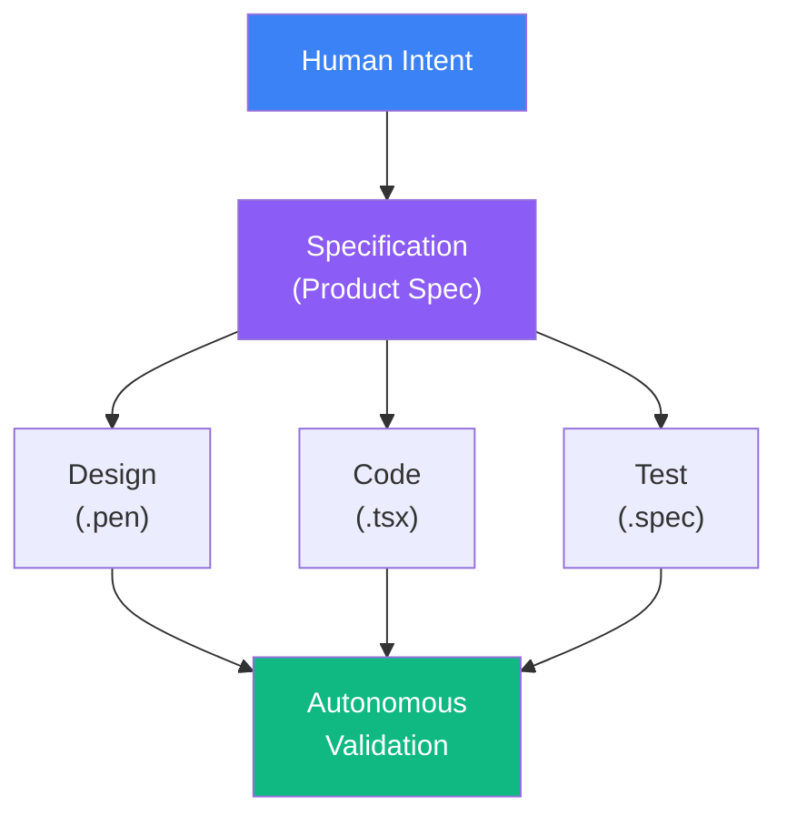
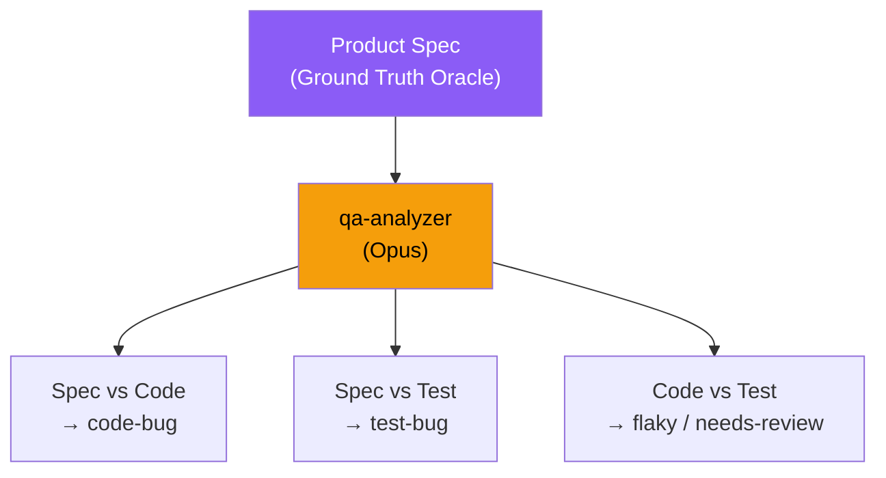
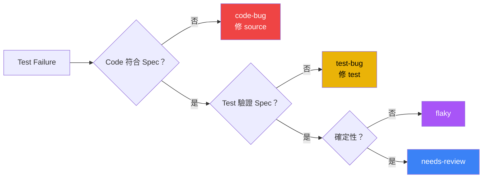

# Harness Engineering

## 你怎麼知道 AI 寫的 Code 是對的？

<!--
大家好，我是 Wayne。今天要分享的主題是 Harness Engineering。

先問大家一個問題——如果今天你的 AI 助手幫你寫了一段 code，你怎麼知道它是對的？

這不是哲學問題。這是我過去 49 天每天在回答的工程問題。
-->

---
layout: center
class: text-center
---

# 一個反直覺的數據

<div class="mt-16 text-2xl opacity-80">
過去 49 天，90% 的 code 不是我寫的 — 但它通過了 QA 驗證
</div>

<div class="mt-4 text-xl opacity-50 italic">
這怎麼可能是對的？
</div>

---
layout: quote
---

# 「有沒有一種可能，起一個 QA agent 每天工作 8 小時，都在測試這個專案，有問題就發 issue 到 Linear？」

<div class="mt-4 text-right opacity-60">
— Wayne, 2026-03-24, Day 7
</div>

<!--
這是 30 天前我在 Claude Code 裡打的一句話。

不是精心設計的架構。不是讀了十篇論文後的結論。就是一個隨口的想法。

但這句話變成了今天你要看到的 9-Agent QA Pipeline 的起點。

接下來讓我們看看，從這句話開始，49 天後變成了什麼。
-->

---

# 49 天，1 個人

<div class="grid grid-cols-2 gap-8 mt-4">
<div>

| 指標 | 數值 |
|------|------|
| 專案啟動日 | 2026-02-28 |
| 全職工程師 | **1 人** |
| 總 commit 數 | 461 |
| AI co-authored | 284 (90%) |
| 總 PR 數 | 72（merged 57） |
| QA Bot 自動 PR | 30（merged 18） |

</div>
<div>

| 指標 | 數值 |
|------|------|
| 產品程式碼 | 13,545 行 |
| E2E 測試碼 | 2,592 行 / 16 檔 |
| 產品規格文件 | 53 份 |
| 執行計劃文件 | 25 份 |
| Feature modules | 5 個 |
| Route coverage | 13/13 (100%) |

</div>
</div>

<div class="mt-6 text-center text-2xl font-bold">
90% AI co-authored · 98.95% E2E pass · 13/13 route coverage
</div>

<div class="mt-2 text-center opacity-60">
為 1,000+ 門市設計的內部數據平台 — 目前 QA 驗證階段
</div>

<!--
這些不是虛構的數字。BerryBoard 是一個為 1000+ 門市設計的營運數據平台，目前在 QA 驗證階段。

重點不是數字大，而是——62% 的 commit 是 AI 寫的。那品質怎麼保證？
-->

---

# 問題來了

<div class="mt-16 text-3xl text-center leading-relaxed">

你怎麼知道 AI 寫的 code **是對的**？

你怎麼知道 AI **沒有漏掉什麼**？

</div>

<div class="mt-12 text-center text-xl opacity-70">
兩個核心命題 —— <span class="text-green-400 font-bold">可行性 (Feasibility)</span> 與 <span class="text-amber-400 font-bold">完備性 (Completeness)</span>
</div>

<!--
這就是今天要回答的兩個核心問題。

可行性比較容易——你看結果就知道。

但完備性非常難——你怎麼證明「沒有遺漏」？這是一個 open problem。
-->

---
layout: section
---

# 第一部分
## 重新定義「AI Coding」

---

# 你以為的 AI Coding

<div class="mt-8">

```
人寫 code → AI 自動補完 → 人看一眼 → 接受
```

</div>

<div class="mt-6 text-xl">

這是 **Autocomplete Paradigm** — GitHub Copilot 級別

加速了「打字」，但 engineering 的核心挑戰不在打字

</div>

---

# 真正的 AI Coding

<div class="mt-4">



</div>

<div class="mt-4 text-lg text-center absolute right-4 bottom-16">

**Full-lifecycle autonomous software engineering**

人的角色：<span class="text-blue-400 font-bold">寫 spec + 做決策</span> &nbsp;|&nbsp; AI 的角色：<span class="text-green-400 font-bold">設計 → 實作 → 測試 → 修復 → 報告</span>

</div>

---
layout: section
---

# 第二部分
## AI-Native Development Pipeline

---

# 五層管線：從意圖到交付

<div class="mt-6">

| Layer | 名稱 | 執行者 | 工具 |
|-------|------|--------|------|
| **0** | Intent Formalization | 人 | 自然語言 |
| **1** | Design Materialization | AI | Pencil MCP |
| **2** | Specification Decomposition | AI | Superpowers SDD |
| **3** | Implementation Synthesis | AI | Claude Code + Agents |
| **4** | Autonomous Verification | AI | **9-Agent QA Pipeline** |

</div>

<div class="mt-6 text-center text-lg">

每一層都是 AI-native — 不是「AI 輔助人」，而是「人設定意圖，AI 執行完整工程流程」

</div>

---

# Layer 0 → 2：Intent → Design → Spec

<div class="grid grid-cols-2 gap-6 mt-4">
<div>

### Pencil.dev (Layer 1)
- AI-native 設計工具
- 透過 MCP 讓 Claude 直接讀寫設計檔
- 設計是 **machine-readable artifact**

### Superpowers SDD (Layer 2)
- Route Spec：頁面行為規格
- Design Spec：元件結構、互動模式
- Execution Plan：分步驟實作計劃

</div>
<div>

```markdown
# 範例：forgot-password.md

## AC-FP-001: Email Input Validation
- Given: invalid email format
- When: clicks "Send Code"
- Then: show "Please enter a valid email"
- And: button disabled during API call

## AC-FP-008: Expired Reset Code
- Given: code expired (30 min)
- When: submits expired code
- Then: "Code expired, request a new one"
```

</div>
</div>

<div class="mt-4 text-center text-amber-400 font-bold">
Spec 是後續所有驗證的 ground truth oracle
</div>

---

# Layer 3：Spec → Implementation

<div class="grid grid-cols-2 gap-6 mt-4">
<div>

### Claude Code Session
1. Read spec (route + design)
2. Read existing code
3. Generate implementation
4. Run typecheck + lint
5. Run tdd-guide agent
6. Run security-reviewer agent
7. Run pr-review skill (4-dimension gate)
8. Create PR

</div>

</div>

---
layout: section
---

# 第三部分
## 9-Agent QA Pipeline
### 完備性論證的核心

---

# Pipeline 全景

<div class="grid grid-cols-[1fr_1fr] gap-4 mt-2">
<div class="text-sm">

### Linear Pipeline
```
qa-planner (Sonnet)
    ↓ test-plan.json
qa-collector (Haiku)
    ↓ results + artifacts
qa-analyzer (Opus)      ← accuracy bottleneck
    ↓ .issues.json
qa-issue-filer (Sonnet)
    ↓ Linear sync
```

### Branch & Converge
```
可自動修復？
  ├─ yes → qa-fixer (Sonnet)    ─┐
  └─ no  → qa-explorer (Sonnet) ─┤
                                  ↓
              qa-reviewer (Sonnet)  ← trajectory critic
                      ↓
              qa-reporter (Haiku)   → Slack
```

</div>
<div class="mt-2">

### 9 Agents, 3 Model Tiers

| Tier | Agents | Why |
|------|--------|-----|
| **Opus** | analyzer | 跨領域推理 |
| **Sonnet** | planner, fixer, explorer, reviewer, issue-filer | Code gen + 結構化 |
| **Haiku** | collector, reporter | 純執行 |

</div>
</div>

<!--
這是 9 個 agent 的完整 pipeline。每天自動跑兩次。

關鍵設計：不是所有 agent 都用最貴的 model。Opus 只用在 analyzer——因為分類決策是 accuracy bottleneck。

一次跑完大約 45 分鐘，成本 2-4 美金。
-->

---

# The Verification Paradox

<div class="mt-2 p-3 bg-blue-900/20 rounded-lg italic text-lg">
「我目前遇到一個問題——昨天 QA agent 有跑，但現在我無法確認他跑的品質。他開的 issue、他改的 code，有沒有意義？」
<div class="text-right text-sm opacity-60 mt-1">— Day 14, 真實對話紀錄</div>
</div>

<div class="mt-4 text-lg">

```
如果 AI 寫了 code，誰來驗證 code 是對的？
如果 AI 寫了 test，誰來驗證 test 是對的？
如果 AI review 了自己的 output，這算不算 self-grading？
```

</div>

<div class="mt-4 p-4 bg-red-900/30 rounded-lg">

### 傳統做法的隱含假設

```
Spec:  「密碼重置碼 30 分鐘後過期」
Code:  EXPIRY = 60 * 60 * 1000          ← 60 分鐘（BUG）
Test:  assert(expiry === 3600000)        ← 驗證了錯誤行為
CI:    ✅ PASS                            ← False Negative
```

Test 和 Code 都是 AI 寫的 → **Circular Validation 死結**

</div>

<!--
上面那段引言是我真實的對話紀錄。QA agent 跑了一整晚，早上起來看到一堆 issue 和 PR——但我不確定這些東西是不是 AI 在自嗨。

這就是 Verification Paradox 的具體體驗。不是理論，是我第 14 天就撞到的牆。

後面的 Evidence Chain 和 Trajectory Critic 就是為了解決這個問題而設計的。
-->

---

# 解法：Specification-Grounded Tripartite Verification

<div class="grid grid-cols-2 gap-6 mt-4">
<div>



</div>
<div class="mt-4">

### 三角驗證

1. **Spec vs Code** — code 行為符合 spec？→ 否 = `code-bug`
2. **Spec vs Test** — test 驗證的行為符合 spec？→ 否 = `test-bug`
3. **Code vs Test** — 兩者都符合 spec 但 fail → `flaky`

<div class="mt-4 p-3 bg-green-900/30 rounded-lg text-center font-bold">
Spec 是人寫的，Code + Test 是 AI 寫的<br/>
三者出自不同來源 → 消除 self-grading
</div>

</div>
</div>

<!--
我們的解法：用 spec 做 ground truth oracle。

關鍵洞察：spec 是人寫的，code 和 test 是 AI 寫的。三者出自不同來源——所以不是 self-grading。

Analyzer 用 Opus 做跨領域推理：同時讀 spec、code、test，判斷問題出在哪裡。
-->

---

# Evidence Chain Protocol

<div class="grid grid-cols-[1.2fr_0.8fr] gap-4">
<div>

每個 issue 必須附帶 **machine-verifiable proof**：

```json {maxHeight:'240px'}
{
  "type": "code-bug",
  "confidence": "high",
  "evidence": {
    "spec_quote": "Reset codes expire after 30 min",
    "code_quote": "auth.ts:42 — EXPIRY = 3600000",
    "reasoning": "Spec 30min, code 60min"
  }
}
```

</div>
<div>

| 欄位 | 設計原理 |
|------|---------|
| `spec_quote` 逐字引用 | 消除 hallucination |
| `code_quote` 含 file:line | 一鍵跳轉 |
| `reasoning` 最多 2 句 | 強制精確 |


</div>
</div>

<!--
每個 issue 不是 AI 的「感覺」——它必須附帶 machine-verifiable proof。

spec_quote 必須逐字引用，不能改寫。code_quote 必須有 file 和行號。reasoning 最多兩句。

效果：人類 reviewer 平均 3 秒就能驗證一個分類是否正確。這是 reviewability by design。
-->

---

# 六類缺陷分類

<div class="grid grid-cols-[1.3fr_0.7fr] gap-4">
<div>



</div>
<div>

| 分類 | 自動化？ |
|-----|---------|
| `code-bug` | Yes — fixer |
| `test-bug` | Yes — fixer |
| `flaky` | Yes — fixer |
| `coverage-gap` | Yes — explorer |
| `perf-regression` | Partial — 人工驗證 |
| `needs-spec-review` | **No — 人工** |

</div>
</div>

---

# Calibrated Confidence

Analyzer 量化自己的 **認知不確定性 (epistemic uncertainty)**：

<div class="grid grid-cols-3 gap-4 mt-4">

<div class="p-3 bg-green-900/30 rounded-lg text-center">
<div class="text-2xl font-bold text-green-400">High</div>
<div class="mt-1">Spec 明確 + Code 明確違反</div>
<div class="mt-1 font-bold">→ 全自動修復</div>
</div>

<div class="p-3 bg-amber-900/30 rounded-lg text-center">
<div class="text-2xl font-bold text-amber-400">Medium</div>
<div class="mt-1">Spec 清楚但 Code 需解讀</div>
<div class="mt-1 font-bold">→ 自動修復</div>
</div>

<div class="p-3 bg-red-900/30 rounded-lg text-center">
<div class="text-2xl font-bold text-red-400">Low</div>
<div class="mt-1">Spec 模糊或缺失</div>
<div class="mt-1 font-bold">→ 強制人工介入</div>
</div>

</div>

<div class="mt-4 text-center text-lg">

**Graduated Autonomy** — Agent 的自主權跟 confidence 成正比

Miscalibration 比 inaccuracy 更危險：accuracy 90% 但 miscalibrated → 自動修了不該修的東西

</div>

<!--
不是所有 issue 都適合自動修復。

High confidence 才全自動。Low confidence 強制 escalate 給人。

重點：miscalibration 比 inaccuracy 更危險。一個說自己很確定但其實不確定的 agent，會自動修掉不該修的東西。
-->

---

# Trajectory Critic：看守 AI 的 AI

**qa-reviewer** 不是一般 code reviewer — 它是 **Trajectory Critic**

<div class="mt-2">

評估整條軌跡，不是單一動作：

```
analyzer 的分類 → fixer 的修復 → PR 的 diff → 測試結果
```

</div>

<div class="mt-3">

| 異常信號 | 含義 | 動作 |
|---------|------|------|
| Low confidence + 嘗試自動修復 | 自動化邊界被突破 | 立即 escalate |
| High confidence + 複雜修復 (>30行) | 認知錯配 | 標記人工審查 |
| 模糊的 `spec_quote` | 證據鏈崩壞 | 阻斷 PR |

</div>

<div class="mt-3 text-center text-lg opacity-80">
Second-Order Quality Assurance — QA 系統的 QA
</div>

---

# Human-in-the-Loop

<div class="p-2 bg-blue-900/20 rounded-lg italic text-base">
「把目前的 QA agent 都停下來，產出太快我目前看不太來。」 <span class="opacity-60">— Day 13</span>
</div>

<div class="mt-2">

```
High Confidence ────→ 全自動（修復 → 審查 → 合併）

Low Confidence  ────→ 人類審查 evidence chain（驗證 → 判斷 → Fixer 執行）
```

</div>

<div class="mt-6 p-5 bg-blue-900/30 rounded-lg text-center text-xl">

人只看真正困難的 **20%**，80% 的 routine triage **完全自動化**

</div>

<div class="mt-4 text-center text-lg opacity-80">

**Cognitive Load Optimization** — 把人類最稀缺的資源（注意力 + 判斷力）集中在機器最不擅長的領域

</div>

---
layout: section
---

# 第四部分
## QA Pipeline

---

# Share-Nothing Architecture

Agent 之間 **零共享記憶體** — artifact-based message passing

<div class="mt-3">

```
qa-planner  ──writes──▶  test-plan.json  ──reads──▶  qa-collector
qa-collector ──writes──▶  results.json   ──reads──▶  qa-analyzer
qa-analyzer  ──writes──▶  .issues.json   ──reads──▶  qa-issue-filer
```

</div>

<div class="grid grid-cols-2 gap-6 mt-3">
<div class="p-4 bg-blue-900/30 rounded-lg">

### 優點
- 每個 agent 可獨立重跑、debug、替換模型
- 單一 agent 失敗 = 局部事件

</div>
<div class="p-4 bg-green-900/30 rounded-lg">

### Safety Invariants
- 每次最多修 **3 個 issue**
- 每個 issue 最多 retry **3 次**
- 每次最多改 **50 行**
- 必須跑 targeted + full regression
- 違反任一條 → **立即中止**

</div>
</div>

# Pipeline 真實指標

<div class="grid grid-cols-2 gap-8 mt-4">
<div>

| 指標 | 數值 |
|------|------|
| Pipeline 執行次數 | 14 (7 天) |
| E2E pass rate 趨勢 | 85% → 98.95% |
| Unit test | 344/344 (100%) |
| Route coverage | 13/13 (100%) |
| Issues 自動分類 | 60 個 |
| Issues 自動修復 | 30+ 個 |
| Issues 自動結案 | 46 個 |
| QA Bot PRs | 30 (merged 18) |

</div>
<div>

| 指標 | 數值 |
|------|------|
| 平均 pipeline 時長 | ~45 min |
| 每次 API 成本 | ~$2-4 |
| 需人工介入 | ~20% |
| Learned patterns | 9 個 |
| Page load | Sub-100ms |
| Zero code-bugs | 最近 7 天 |

</div>
</div>

<div class="mt-4 text-center text-lg text-green-400 font-bold">
Source code 完全符合 spec — 所有近期 failure 都是 test-bug / flaky
</div>

---

# QA Bot 實際 PR

<div class="mt-2 text-sm">

| PR | 內容 | 狀態 |
|----|------|------|
| #73 | AC-LOGIN-05 漸進式登入延遲 E2E 覆蓋 | Open |
| #72 | video-link mock URL mismatch 修復 | Open |
| #71 | corp selection 測試補充 | Merged |
| #68 | AC-FP-11 + AC-DASH-02 E2E 覆蓋 | Merged |
| #67 | FastAPI 422 array detail 修復 + 429 test fix | Merged |
| #66 | GA4 error tracking SB-03/04/05 | Merged |
| #64 | Superset iframe error state 修復 | Merged |
| #63 | 429 message 修正 + 422 array detail 處理 | Merged |

</div>

<div class="mt-4 text-center text-lg">

QA Bot 不只寫測試 — 它也修 **source code**

#67 修了 FastAPI 422 處理，#64 修了 iframe error state

**Autonomous Remediation**

</div>

---
layout: section
---

# 結論

---

# 回答兩個問題

<div class="grid grid-cols-2 gap-8 mt-8">

<div class="p-6 bg-green-900/30 rounded-lg">
<div class="text-xl font-bold text-green-400 mb-4">Q1: AI Coding 可行嗎？</div>

461 commits、72 PRs、13,545 行 code

98.95% E2E pass rate

49 天、1 人

**QA pipeline 的真實數據就是答案**

</div>

<div class="p-6 bg-amber-900/30 rounded-lg">
<div class="text-xl font-bold text-amber-400 mb-4">Q2: 怎麼證明完備性？</div>

1. 人寫 spec (ground truth)
2. AI 寫 code + test (derived)
3. AI 用 spec 驗證 (independent)
4. AI 審查驗證 (trajectory critic)
5. 不確定 → escalate (graduated autonomy)

**有 spec、有 evidence、有 calibration、有 human boundary**

</div>
</div>

---

# Q & A 环节精选 ref: [字節跳動 Web Infra](https://github.com/zhoushaw/Context-Engineering-to-Harness-Engineering?tab=readme-ov-file)

<div>
Q：AI 产生很多文件变更（几十个变更），你只关心单测和测试结果有没有覆盖到，但怎么让整个代码架构朝着合适的方向前进，而不是因为 AI 的变更导致代码不好维护？

A： 这个问题我相信大家可能都比较感同身受。这里我要呈现两个点：

第一，今天大家所认为的标准是不是真的合理？比如 AI 给你一个文件写了两三千行代码，对人来说这好像是一个难以接受的事情——因为没有哪一个同事会给你写个两三千行的一个文件出来。但我们需要有新的定义，不是局限于过去人该怎么做那今天 AI 就怎么做，核心点在于这件事情对 AI 来说是不是合理的。

第二，既然今天 AI 改了这么多代码，但我并不相信它只跑一次单测就能够把我所关心的问题覆盖到。这也是为什么到今天 AI 并没有造成大规模的失业，因为今天这个差距确实存在——像 Midscene.js 这样的产品解决了端到端测试，但我们的产品在变更之后有没有性能劣化？有没有内存增长？这些都是大家需要深度思考的问题。

我理解这也是机会所在——今天为什么 AI 写完代码之后没有帮你把剩下的工作搞定？这不就是大家的机会吗？这个机会会诞生非常多有价值的公司以及非常有价值的产品。我相信在座的各位都有机会把 AI 没干完的活更好地解决。
</div>

---
layout: center
class: text-center
---

# 最後一句

<div class="mt-8 text-lg opacity-70">

人做判斷，AI 做執行

人定義「對」，AI 驗證「對不對」

</div>

<!--
最後一句話。

這個 pipeline 不是要取代 QA，是要把 QA 從 manual labor 升級成 systematic reasoning。

人負責判斷，AI 負責執行。人定義什麼是「對」，AI 驗證「對不對」。

謝謝大家。有問題歡迎提問。
-->
